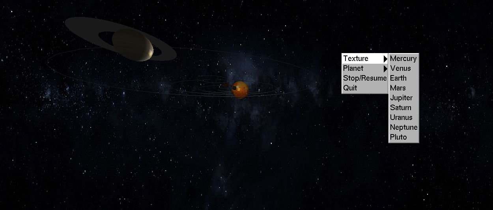

# Sistema Solar para a Disciplina DCA0114 - Computação Gráfica na UFRN

## Bibliotecas necessárias:
- freeGLUT (ou Glut)
- OpenGL

## Texturas

As texturas devem ser formato bitmap(.bmp) e devem ser especificadas na variavel 'char* texturas[]' no começo do código

## Funcionalidades

- É possivel interagir com o programa utilizando o scrool do mouse para controlar o zoom ou utilizar as teclas ` + ` e `-`, utilizando as teclas `1, 2, 3` é possível alternar as visões do sistema solar e utilizando as teclas `d` e `s` o sistema encerra/resume todos os movimentos.
- É possivel arrastar o sistema segurando o botão esquerdo do mouse e o abrir o menu com o botão direito.
- Os menus podem criar um planeta com textura escolhida, parar/resumir somente o movimento de translação e finalizar o programa

Caso esteja no Linux, com a biblioteca OpenGL e GLUT, execute o seguinte comando para compilar e executar:

    g++ main.cpp imageloader.cpp -lX11 -lXi -lXmu -lglut -lGL -lGLU -lm -o final && ./final

